# 测试

## 前提
* 已按照正常运行

## 注册

注册页面

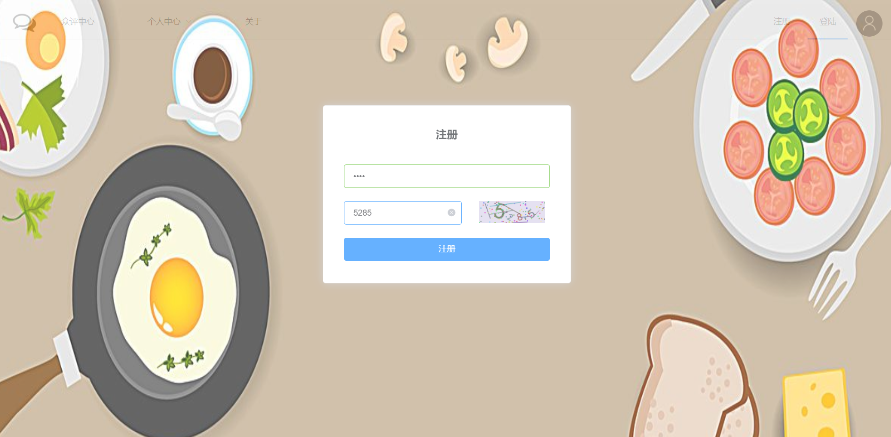

注册成功

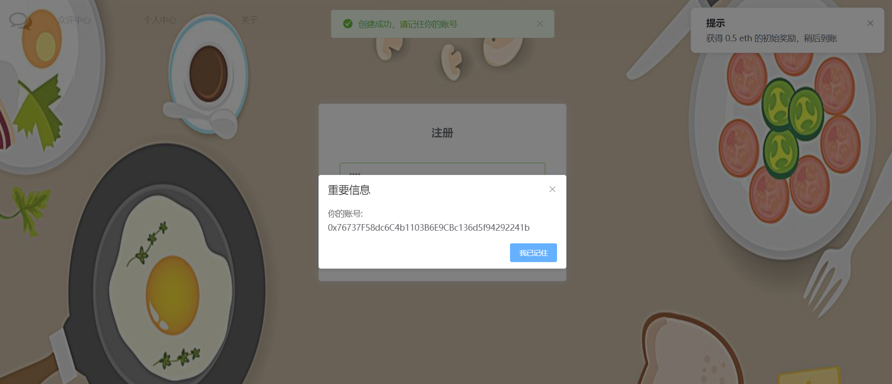

注册成功后，确认后将跳转到登陆界面

## 登陆

登陆界面

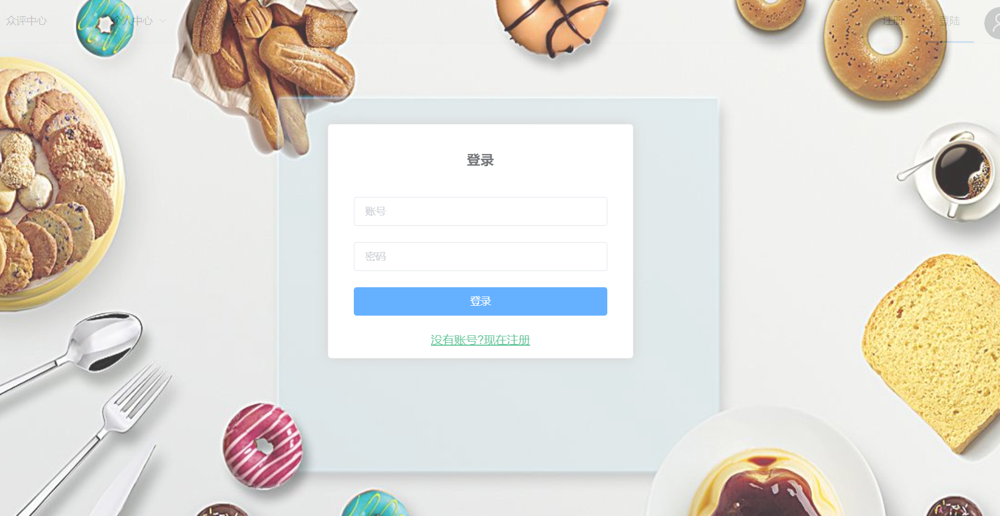

登陆成功后跳转
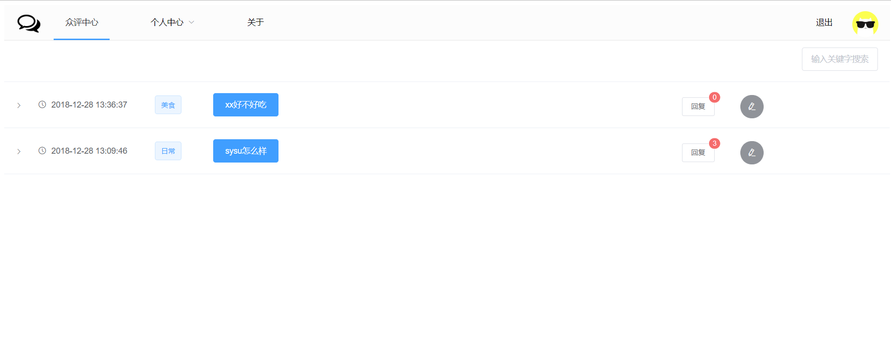
主页内容为之前测试数据

## 查看个人信息
可以看到有`0.5eth`，以及一笔转账记录（注册成功的奖励）
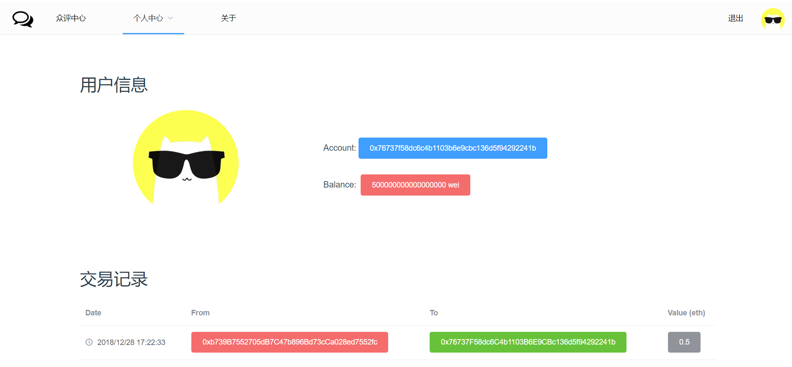

## 发布新主题

发布
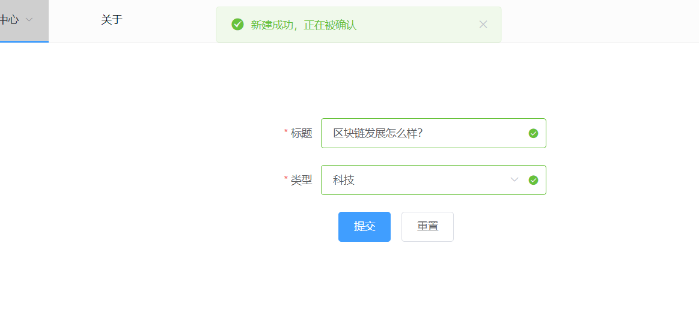

交易被确认后
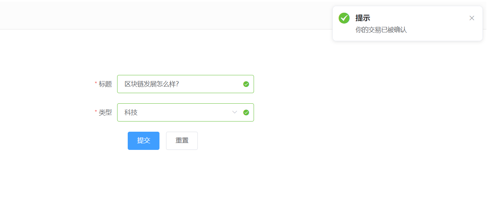

主页展示
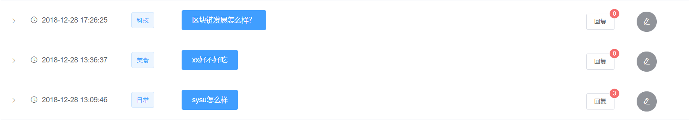

## 查看评论

点击每条主题左侧将展开
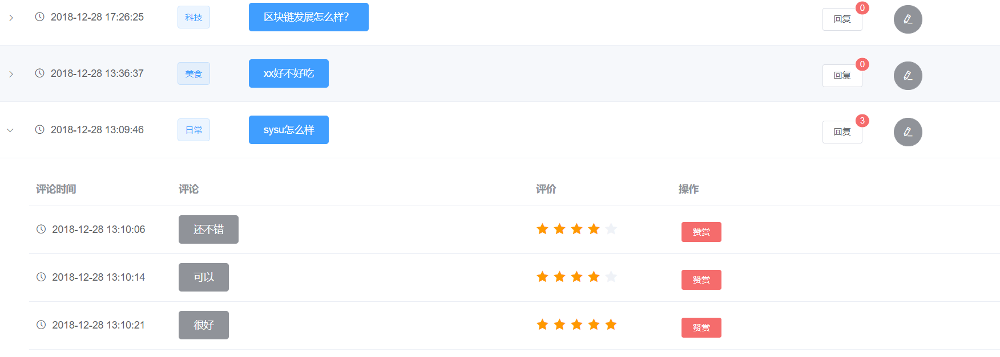

## 评论

点击右侧评论按钮
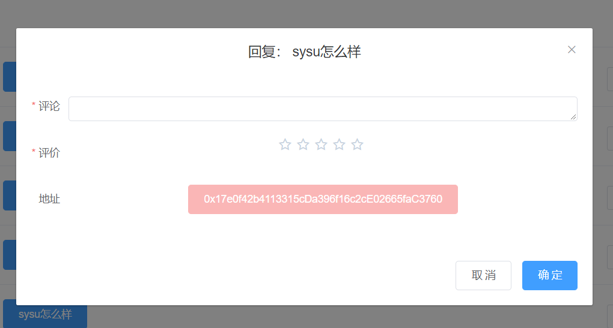

随便填点东西提交，可以看到新的交易提示
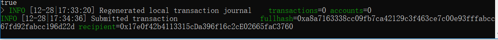

继续挖矿，交易被确认，收到交易被确认提示后刷新下，再次看下刚刚的
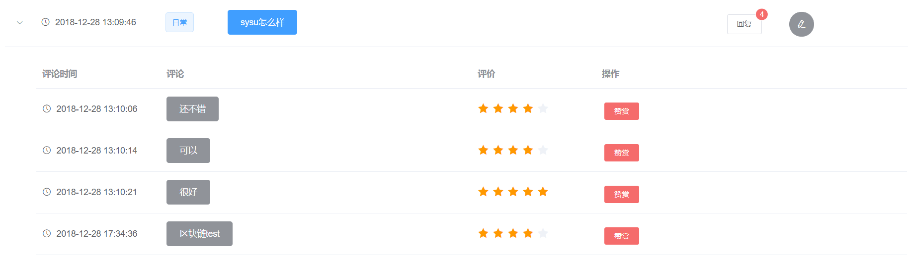

在评论处可以看到具体信息
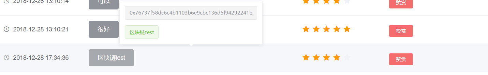

## 赞赏

比如觉得第一个回复不错，赞赏一下
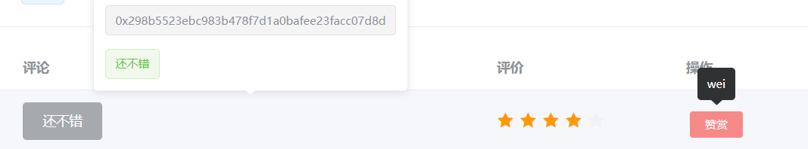

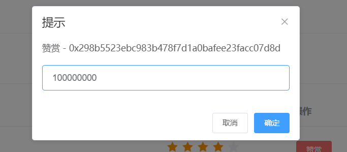

点击后再次查看控制台，可以看到新的交易信息
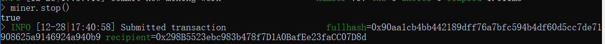

挖矿确认交易,可以查看下自己的交易记录

## 游客模式
游客模式想要访问一些权限页面给予提示
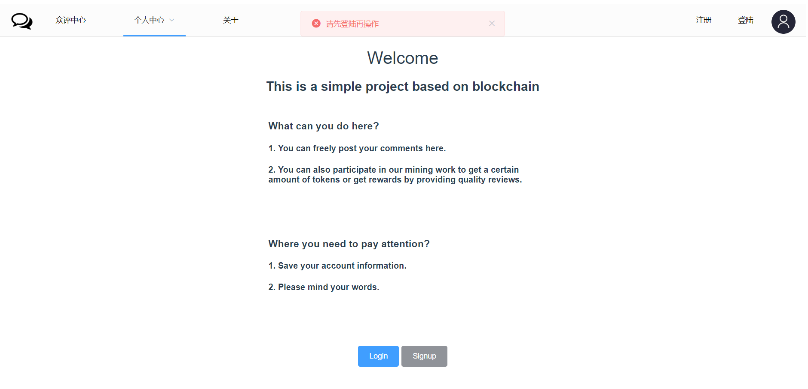

## 其他
初始设计的基本实现了。当然一些发起交易的时候`余额不足`也有提示，`每个用户对于某个主题只能评论3次`，多余的将不会记录。功能都已完成，`UI交互`设计的有些比较水，然后~~更多好玩的~~自己发现下吧